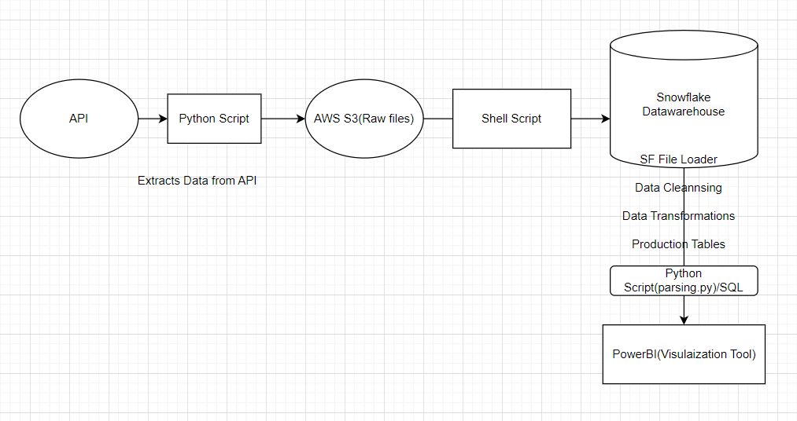
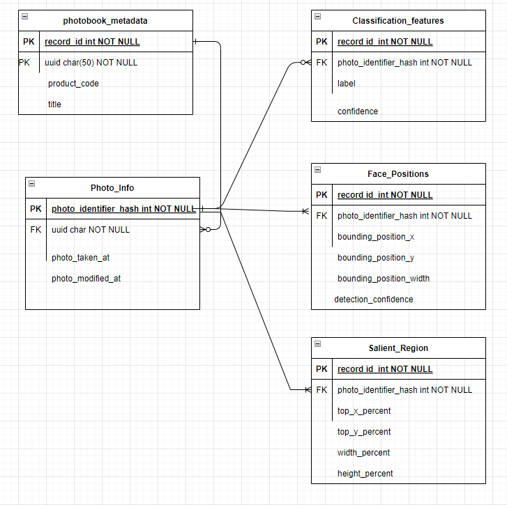

## Tools required
- IDE - Vscode or Pycharm
- Language - Python

## Architecture

## Data model

## Steps to run the pipeline    
- Shell Script
    - Python script 
        - to extract API response
        - store reposne in AWS S3
    - load raw data from S3 into Snowflake warehouse 
    - Parse the data using python connectors or SQL scripts
    - Apply business logic
    - Create production data - final views

- Step Functions - Orchestration service
- Cloud Watch Events - create rules and  config json (git file names and the parameters)

## Costs
This is a cloud based solution using standard AWS & Snowflake costs. There are open source items too which are cost effective.
